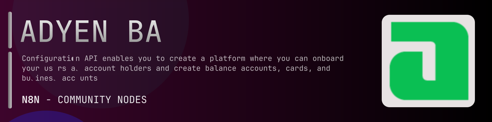

# @n8n-dev/n8n-nodes-adyen-balanceplatformservice



[](https://www.npmjs.com/package/@n8n-dev/n8n-nodes-adyen-balanceplatformservice)
[](https://opensource.org/licenses/MIT)

---

**Stop writing adyen-balanceplatformservice API integrations by hand.**

Every time you connect n8n to adyen-balanceplatformservice, you waste hours mapping endpoints, defining parameters, and debugging schemas. You copy-paste from docs, fix edge cases, and pray nothing breaks.

**What if connecting n8n to adyen-balanceplatformservice took 5 minutes, not half a day?**

This node gives you **9+ resources** out of the box: **Platform**, **Grant Offers**, **Payment Instrument Groups**, **Account Holders**, **Payment Instruments**, and 4 more: with full CRUD operations, typed parameters, and zero manual configuration.

---

## What You Get

- **Zero boilerplate**: Resources, operations, and fields are pre-configured and ready to use
- **Full CRUD**: Create, read, update, and delete support where the API allows it
- **Typed parameters**: No more guessing field types
- **Built-in auth**: API key authentication, ready to go
- **Declarative**: Native n8n performance, no custom execute() overhead

---

## Install

```bash
npm install @n8n-dev/n8n-nodes-adyen-balanceplatformservice
```

**Or in n8n:**
1. **Settings → Community Nodes → Install**
2. Search: `@n8n-dev/n8n-nodes-adyen-balanceplatformservice`
3. Click **Install**

---

## Quick Start

1. Install the node (above)
2. Add credentials: **adyen-balanceplatformservice API** → paste your API key
3. Drag the **adyen-balanceplatformservice** node into your workflow
4. Pick a resource → pick an operation → done.

That's it. No configuration files. No code. It just works.

---

## Resources

<details>
<summary><b>Platform</b> (2 operations)</summary>

- Get a balance platform
- Get all account holders under a balance platform

</details>

<details>
<summary><b>Grant Offers</b> (2 operations)</summary>

- Get all available grant offers
- Get a grant offer

</details>

<details>
<summary><b>Payment Instrument Groups</b> (3 operations)</summary>

- Post Create a payment instrument group
- Get a payment instrument group
- Get all transaction rules for a payment instrument group

</details>

<details>
<summary><b>Account Holders</b> (4 operations)</summary>

- Post Create an account holder
- Get an account holder
- Patch Update an account holder
- Get all balance accounts of an account holder

</details>

<details>
<summary><b>Payment Instruments</b> (5 operations)</summary>

- Post Create a payment instrument
- Get a payment instrument
- Patch Update a payment instrument
- Get the PAN of a payment instrument
- Get all transaction rules for a payment instrument

</details>

<details>
<summary><b>Grant Accounts</b> (1 operations)</summary>

- Get a grant account

</details>

<details>
<summary><b>Bank Account Validation</b> (1 operations)</summary>

- Post Validate a bank account

</details>

<details>
<summary><b>Balance Accounts</b> (9 operations)</summary>

- Post Create a balance account
- Get all sweeps for a balance account
- Post Create a sweep
- Delete a sweep
- Get a sweep
- Patch Update a sweep
- Get a balance account
- Patch Update a balance account
- Get all payment instruments for a balance account

</details>

<details>
<summary><b>Transaction Rules</b> (4 operations)</summary>

- Post Create a transaction rule
- Delete a transaction rule
- Get a transaction rule
- Patch Update a transaction rule

</details>

---

## Why This Node?

**Without this node:**
- Hours of manual API integration
- Copy-pasting from adyen-balanceplatformservice docs
- Debugging auth, pagination, error handling
- Maintaining your own client code

**With this node:**
- Install → configure → use. 5 minutes.
- Auto-generated from the official adyen-balanceplatformservice OpenAPI spec
- Always up to date when the API changes
- Native n8n performance

---

## Auto-Generated
This node was auto-generated from the official **adyen-balanceplatformservice** OpenAPI specification using
[@n8n-dev/n8n-openapi-node-ultimate](https://github.com/kelvinzer0/n8n-openapi-node-ultimate),
then validated against the live API so you get accurate types and real parameters, not guesswork.

When the adyen-balanceplatformservice API updates, this node updates too.

---


## License

MIT © [kelvinzer0](https://github.com/n8n-code)
